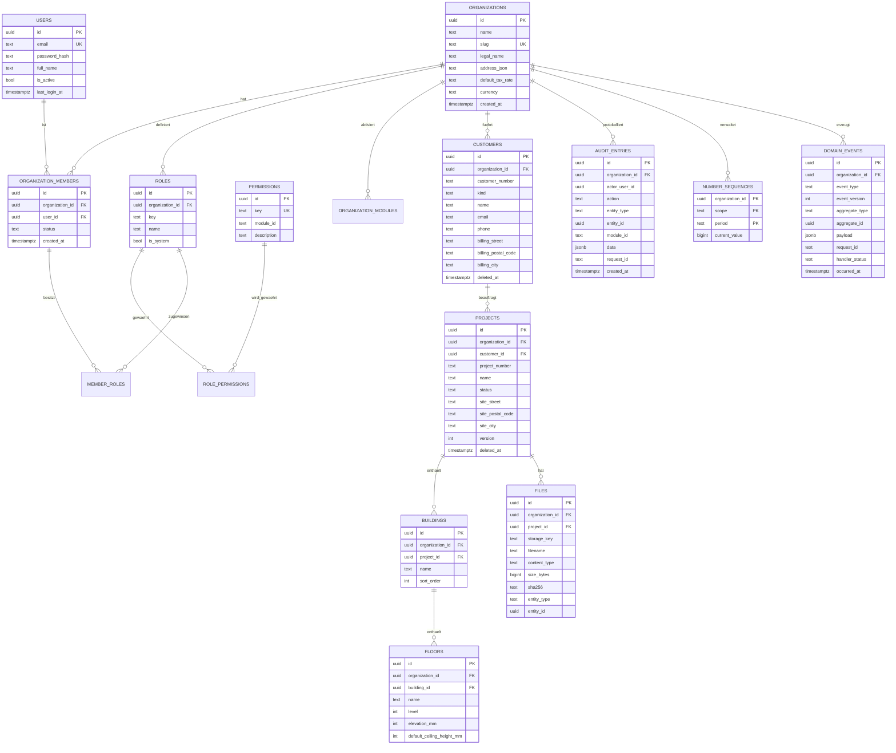
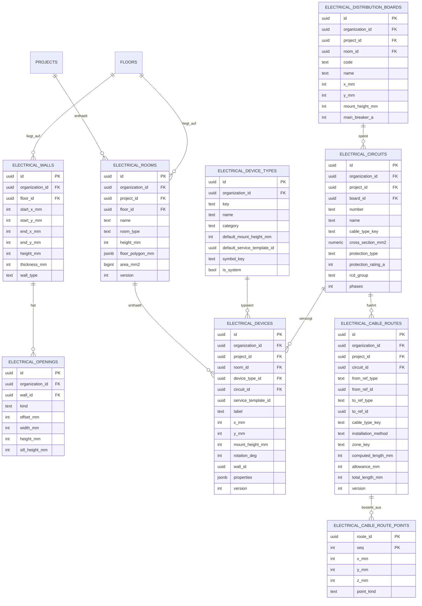
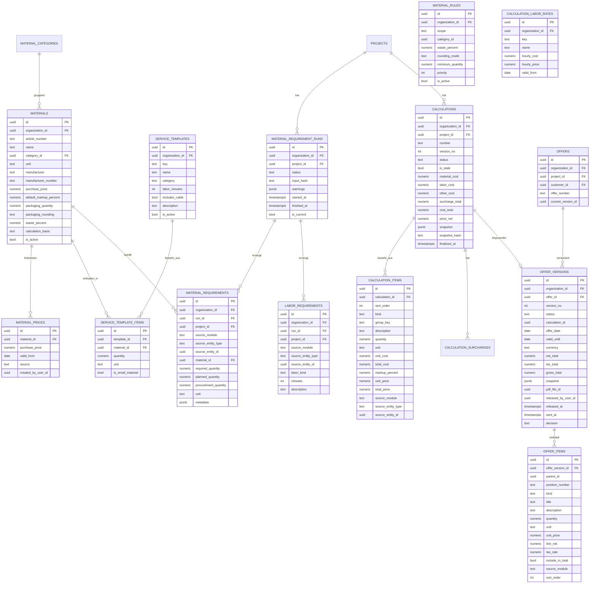
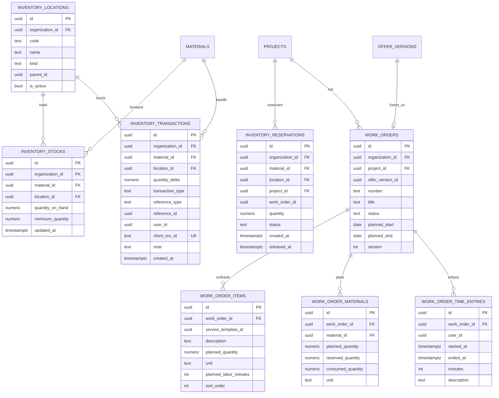

# Datenbank und ER-Modell

Version: 1.0 (Phase 0 — Entwurf, noch keine Migration erzeugt)
Datenbank: PostgreSQL 17
ORM: SQLAlchemy 2.0 · Migrationen: Alembic (ein einziger Strang)

Dieses Dokument ist das verbindliche fachliche Datenmodell. Spalten können sich in der
Umsetzung im Detail ändern; Entitäten, Beziehungen und Grenzen nicht ohne ADR.

---

## 1. Konventionen

| Thema | Regel |
|---|---|
| Primärschlüssel | `id uuid PRIMARY KEY DEFAULT gen_random_uuid()` |
| Mandant | `organization_id uuid NOT NULL` auf jeder mandantenbezogenen Tabelle |
| Fremdschlüssel (mandantenbezogen) | **zusammengesetzt**: `(organization_id, <ref>_id)` → `ziel(organization_id, id)` |
| Zeitstempel | `created_at`, `updated_at` als `timestamptz`, immer UTC |
| Fachliche Daten | `date` ohne Zeitzone (z. B. `valid_until`) |
| Optimistisches Sperren | `version integer NOT NULL DEFAULT 1` auf Geschäftsentitäten |
| Löschen | `deleted_at timestamptz NULL` (Soft Delete) für Geschäftsdokumente; Hard Delete nur über den dokumentierten DSGVO-Pfad |
| Tabellennamen | Plural, Modulpräfix bei Nicht-Core-Modulen: `electrical_`, `inventory_`, `calculation_`, `offer_`, `work_order_`, `material_` |
| Geometrie | ganzzahlige **Millimeter**, Suffix `_mm` |
| Geld | `numeric(12,4)` für Einzelpreise, `numeric(12,2)` für Summen |
| Mengen | `numeric(14,3)` |
| Enums | als `text` + `CHECK`-Constraint, nicht als PostgreSQL-Enum (Migrationen bleiben einfach) |
| Constraint-Namen | feste Naming Convention in SQLAlchemy, damit Alembic-Autogenerate stabil ist |

### Warum zusammengesetzte Fremdschlüssel

```sql
-- statt:  project_id uuid REFERENCES projects(id)
ALTER TABLE electrical_rooms
  ADD CONSTRAINT fk_electrical_rooms_project
  FOREIGN KEY (organization_id, project_id)
  REFERENCES projects (organization_id, id);
```

Damit kann ein Datensatz von Organisation A **technisch nicht** auf einen Datensatz von
Organisation B verweisen. Voraussetzung: jede referenzierte Tabelle hat zusätzlich
`UNIQUE (organization_id, id)`.

### Mixins

| Mixin | Spalten |
|---|---|
| `UUIDPrimaryKey` | `id` |
| `Timestamped` | `created_at`, `updated_at` |
| `Versioned` | `version` (SQLAlchemy `version_id_col`) |
| `TenantScoped` | `organization_id` + `UNIQUE (organization_id, id)` |
| `SoftDeletable` | `deleted_at` |
| `Authored` | `created_by_user_id`, `updated_by_user_id` |

---

## 2. Übersicht der Module und Tabellen

| Modul | Präfix | Tabellen |
|---|---|---|
| Core | — | `organizations`, `users`, `organization_members`, `roles`, `permissions`, `role_permissions`, `member_roles`, `refresh_tokens`, `organization_modules`, `customers`, `projects`, `buildings`, `floors`, `files`, `audit_entries`, `number_sequences`, `domain_events` |
| materials | `material_` | `material_categories`, `materials`, `material_prices`, `material_rules`, `service_templates`, `service_template_items`, `material_requirement_runs`, `material_requirements`, `labor_requirements` |
| inventory | `inventory_` | `inventory_locations`, `inventory_stocks`, `inventory_transactions`, `inventory_reservations` |
| calculation | `calculation_` | `calculation_labor_rates`, `calculations`, `calculation_items`, `calculation_surcharges` |
| offers | `offer_` | `offers`, `offer_versions`, `offer_items` |
| work_orders | `work_order_` | `work_orders`, `work_order_items`, `work_order_materials`, `work_order_time_entries`, `work_order_notes` |
| electrical | `electrical_` | `electrical_device_types`, `electrical_rooms`, `electrical_walls`, `electrical_openings`, `electrical_devices`, `electrical_distribution_boards`, `electrical_circuits`, `electrical_cable_routes`, `electrical_cable_route_points` |

Anmerkung: `materials`, `material_requirements` und `service_templates` liegen bewusst im
selben Modul (`materials` = Katalog + Material Engine). Begründung in
[ADR 0003](decisions/0003-module-contracts-and-provider-ports.md).

---

## 3. ER-Modell — Core



### Wichtige Constraints (Core)

- `organizations.slug` UNIQUE
- `users.email` UNIQUE (immer klein geschrieben gespeichert)
- `organization_members` UNIQUE `(organization_id, user_id)`
- `roles` UNIQUE `(organization_id, key)`
- `permissions.key` UNIQUE, Format `<modul>.<objekt>.<aktion>`
- `customers` UNIQUE `(organization_id, customer_number)`
- `projects` UNIQUE `(organization_id, project_number)`
- `number_sequences` PK `(organization_id, scope, period)` — Vergabe per
  `SELECT ... FOR UPDATE`
- `domain_events` ist **append-only** (kein UPDATE außer `handler_status`)

---

## 4. ER-Modell — Electrical (Fachmodul)



**Hinweise**

- `floor_polygon_mm` ist ein JSONB-Array `[[x,y], …]` in Millimetern. Es ist ein
  geschlossener, einfacher Polygonzug; Validierung (keine Selbstüberschneidung, mind. 3
  Punkte) erfolgt im Service, nicht in der Datenbank.
- Streckenpunkte sind **normalisiert**, nicht JSONB: Sie werden einzeln bearbeitet und
  müssen deterministisch summierbar sein.
- `total_length_mm = computed_length_mm + allowance_mm`. Beide Werte werden gespeichert,
  damit im Angebot nachvollziehbar bleibt, wie viel Zuschlag enthalten ist.
- Kein PostGIS. Die Geometrie ist projektlokal, klein und wird nie geografisch abgefragt.

---

## 5. ER-Modell — Materials, Calculation, Offers



> **Struktureller Schutz (§29):** In `OFFER_VERSIONS` und `OFFER_ITEMS` existiert keine
> einzige Kostenspalte. Ein Angebot kann Einkaufspreise oder Margen nicht enthalten, weil
> es keinen Ort dafür gibt.

### Wichtige Constraints

- `materials` UNIQUE `(organization_id, article_number)`
- `service_templates` UNIQUE `(organization_id, key)`
- `material_requirement_runs`: partieller Unique-Index
  `UNIQUE (project_id) WHERE is_current` — pro Projekt genau ein aktueller Lauf
- `calculations` UNIQUE `(organization_id, number, version_no)`
- `offers` UNIQUE `(organization_id, offer_number)`
- `offer_versions` UNIQUE `(offer_id, version_no)`
- `offer_items.kind` CHECK in (`heading`,`text`,`item`,`optional`,`alternative`,`lump_sum`)
- `offer_versions.status` CHECK in (`draft`,`released`,`sent`,`accepted`,`rejected`,
  `expired`)
- Freigegebene `offer_versions` sind unveränderlich — durchgesetzt im Service und
  zusätzlich über einen `UPDATE`-Trigger, der nur Statusfelder zulässt.

---

## 6. ER-Modell — Inventory und Work Orders



**Bestandsregeln**

- `inventory_transactions` ist die **Quelle der Wahrheit** und append-only.
- `inventory_stocks.quantity_on_hand` ist ein gepflegter Aggregatwert, der ausschließlich
  in derselben Transaktion wie die Bewegung fortgeschrieben wird (`SELECT ... FOR UPDATE`
  auf der Bestandszeile).
- Ein Wartungstest rechnet stichprobenartig `SUM(quantity_delta)` gegen
  `quantity_on_hand`.
- `verfügbar = quantity_on_hand − Σ(aktive Reservierungen)`; nicht gespeichert, sondern
  berechnet.
- `client_txn_id` UNIQUE `(organization_id, client_txn_id)` macht Buchungen idempotent —
  Voraussetzung für die Baustellen-App.

---

## 7. Indizes (Ausgangsmenge)

| Tabelle | Index |
|---|---|
| alle mandantenbezogenen | `(organization_id, id)` UNIQUE |
| `projects` | `(organization_id, customer_id)`, `(organization_id, status)` |
| `electrical_devices` | `(organization_id, project_id)`, `(room_id)`, `(circuit_id)` |
| `electrical_cable_routes` | `(organization_id, project_id)`, `(circuit_id)` |
| `electrical_cable_route_points` | PK `(route_id, seq)` |
| `material_requirements` | `(run_id)`, `(organization_id, project_id)`, `(material_id)` |
| `inventory_transactions` | `(organization_id, material_id, location_id, created_at)` |
| `inventory_reservations` | partiell `(material_id, location_id) WHERE status='active'` |
| `offer_versions` | `(offer_id, version_no)` |
| `audit_entries` | `(organization_id, created_at DESC)`, `(entity_type, entity_id)` |
| `domain_events` | `(organization_id, occurred_at DESC)`, `(event_type)` |

Weitere Indizes erst nach Messung (`EXPLAIN ANALYZE`), nicht auf Verdacht.

---

## 8. Migrationen

- **Ein** Alembic-Strang für die gesamte Datenbank. `alembic heads` muss genau einen Head
  liefern; in CI geprüft.
- Migrationen sind vorwärtsgerichtet; `downgrade` wird nur dort gepflegt, wo es trivial
  ist.
- Datenmigrationen laufen nie automatisch beim Start, sondern über einen expliziten Befehl.
- **Keine** Datenbankerweiterungen nötig: `gen_random_uuid()` ist seit
  PostgreSQL 13 im Kern enthalten, und E-Mails werden statt über `citext`
  grundsätzlich klein geschrieben gespeichert (Normalisierung im Service).
  Das hält Migrationen und Testdatenbanken erweiterungsfrei.
- Seeds (Systemrollen, Permissions, Basis-Gerätetypen, Standard-Installationszonen) sind
  idempotente Skripte, keine Migrationen.

---

## 9. Backup und Integrität

- Tägliches `pg_dump` plus WAL-Archivierung (Betriebskonzept ab Phase 1 dokumentiert,
  Automatisierung vor Produktivbetrieb).
- Restore muss getestet sein, bevor echte Kundendaten erfasst werden.
- Object Storage wird getrennt gesichert; ein Datenbank-Restore ohne passende Dateien ist
  unvollständig.
- Fremdschlüssel und CHECK-Constraints werden aktiv genutzt — Integrität gehört in die
  Datenbank, nicht nur in die Anwendung.
